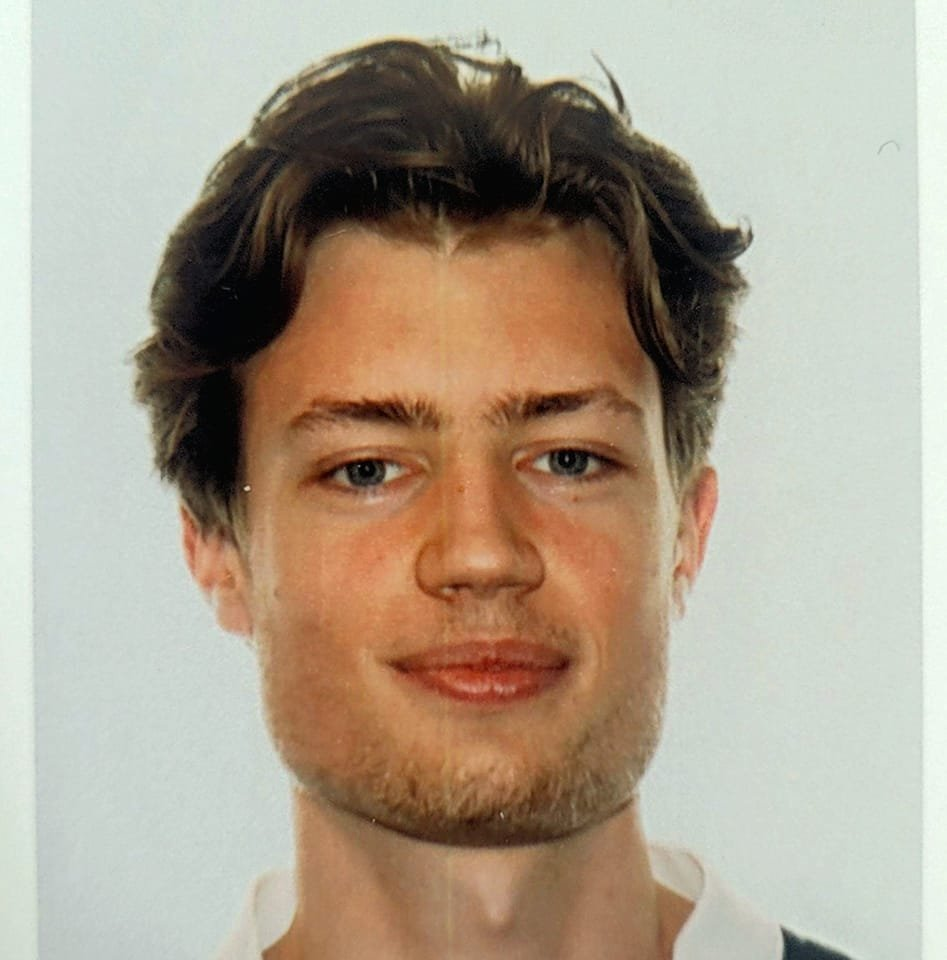

Artificial Intelligence Researcher

Hi! I am a PhD Student at **[Mila](https://mila.quebec/en/)** and **[McGill University](https://www.mcgill.ca/)** supervised by **[Doina Precup](https://mila.quebec/en/person/doina-precup/)** and **[Lars Grant](https://www.ladydavis.ca/en/researcher/lars-grant/)**. I previously completed a BSc at **[McGill University](https://www.mcgill.ca/)**, for which I received the **[First-Class Honours distinction](https://www.mcgill.ca/study/2024-2025/university_regulations_and_resources/undergraduate/gi_graduation_honours)** and the **[Dean’s Multidisciplinary Undergraduate Research List Distinction](https://www.mcgill.ca/study/2024-2025/university_regulations_and_resources/undergraduate/gi_graduation_honours)**, during which I completed 5 research internships working with **[Doina Precup](https://mila.quebec/en/person/doina-precup/)**, **[David Juncker](https://juncker.lab.mcgill.ca/david-juncker)**, **[Gabriel Venne](https://www.mcgill.ca/ihse/about-us/who-we-are/associate-members/gabriel-venne)** and **[Peter Metrakos](https://rimuhc.ca/fr/-/peter-metrakos-md)**.

__My two main research goals are:__
- __Improving how intelligent agents learn and make decisions in complex environments, especially when those environments involve many possible actions and sparse rewards__.
- __Applying AI to support healthcare workers and patients in their decision making to promote safety, robustness in uncertain contexts, and efficiency in data-constrained environments__.

I am a recipient of the:
- **[Fonds de Recherche du Québec – Santé (FRQS) Scholarship](https://frq.gouv.qc.ca/en/health/)**
- **[Schull-Yang International Experience Award](https://www.mcgill.ca/iea/article/flemming-kondrup-bsc-anatomy-and-cell-biology-miea-ambassador-2021)**
- **[McGill Quantitative Life Science Stipend Award](https://www.mcgill.ca/qls/program-info)**

Research

**Enhancing how agents acquire knowledge and make decisions in challenging environments:**

    
    

        <strong>A Generative approach to Affordances for Reinforcement Learning</strong>  
        
Aim: Leveraging VLMs to improve RL sample efficiency and performance

        
Prospective Publication

    

<u>A Generative approach to Affordances for Reinforcement Learning</u> 

Aim: Leveraging VLMs to improve RL sample efficiency and performance  
*Prospective Publication*

AI for Healthcare:

Service and Leadership

In 2022, I was captain of McGill's team in **[Project X](https://www.uoft.ai/projectx)**, an AI research competition organized by the University of Toronto with competitors from top academic institutions across North America with renowned sponsors (Google, IBM, Moderna etc.). Our work on **[Deep Conservative Reinforcement Learning for Mechanical Ventilation](https://doi.org/10.1609/aaai.v37i13.26862)** received the highest score out of all 25 papers submitted, winning the competition with a $25,000 award, and leading to press interviews with **[The Tribune](https://www.thetribune.ca/sci-tech/six-mcgill-undergrads-win-uoft-international-artificial-intelligence-competition-03152022/)** and **[The McGill Reporter](https://reporter.mcgill.ca/undergrad-team-uses-machine-learning-to-create-a-better-hospital-ventilator/)**.

In 2023-2024, I served as the Executive Director of the **[McGill Student Emergency Response Team (MSERT)](http://msert.ca/)**, overseeing a team of over 70 responders dedicated to providing emergency medical aid. In addition to managing a $100,000 budget and supervising a 7-member executive board, I facilitated communication between MSERT, the McGill University administration, and governmental agencies. My approach emphasized thoughtful leadership and fostering a collaborative team dynamic, enabling MSERT to expand its services and educational outreach. Over the past five years, I have also volunteered as a responder, contributing more than 2000 hours to the team’s efforts.

