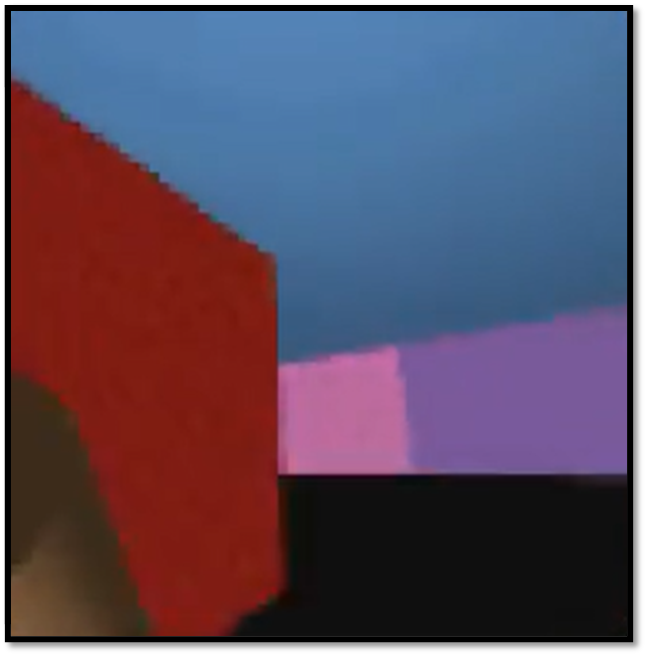
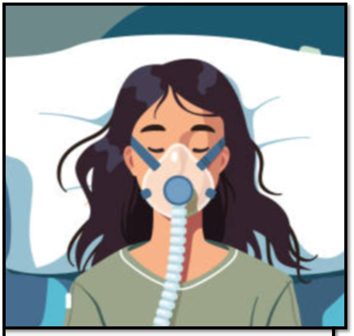

Artificial Intelligence Researcher

Hi! I am a PhD Student at **[Mila](https://mila.quebec/en/)** and **[McGill University](https://www.mcgill.ca/)** supervised by **[Doina Precup](https://mila.quebec/en/person/doina-precup/)** and advised by **[Joelle Pineau](https://ai.meta.com/people/1914216782353556/joelle-pineau/)** and **[Lars Grant](https://www.ladydavis.ca/en/researcher/lars-grant/)**. **My research interests center on developing *Safe AI Agents*, with two primary aims:**
* **Teaching Agents to adapt smoothly to human workflows, preferences, and web navigation via Reinforcement Learning.**
* **Evaluating the risks in scaling autonomous Agents, with emphasis on identifying misalignment and hidden vulnerabilities.**

Work Experience:

    
    

        <strong>Student Researcher – Google, Seattle, USA</strong>  
        
Reinforcement Learning for LLM finetuning on Agentic Tasks

        
<em> Fall 2025 | Mentor: Aldi Fahrezi & Galen Ballew</em>

    

 

    
    

        <strong>Machine Learning Intern – ServiceNow, Montreal, Canada</strong>  
        
Developing LLM-based agents for computer use and web navigation, focusing on: (1) methods for adapting to human workflows and preferences; (2) safety through detection pipelines for hidden backdoors, combining reasoning-trace and activation-level anomaly analysis, and examining misalignment and collusion in multi-agent systems.

        
<em> July - October 2025 | Mentor: Gabriel Huang</em>

    

 

    
    

        <strong>Machine Learning Intern – Dialogue, Montreal, Canada</strong>  
        
	Led the successful deployment of Generative Vision-Language Models (VLMs) in production to automate patient photo verification for telemedicine, boosting classification accuracy by 17% and streamlining the intake process, and developed a novel LLM-powered symptom intake system to reduce patient input time and improve triage. 

        
<em>Jan – April 2025 | Mentor: Alexis Smirnov</em>

    

 

    
    

        <strong>Research Intern - Royal Victoria Hospital, Montreal, Canada</strong>  
        
	Leveraged immune cell computational analyses to uncover immunotherapy targets in hepatocellular carcinoma and cholangiocarcinoma, elucidating tumor environment dynamics and innovation in liver cancer treatment strategies.  

        
<em> Sept 2020 – August 2021 | Mentor: Peter Metrakos</em>

    

 

Awards:

I am a recipient of the:
- **[Fonds de Recherche du Québec (FRQ) Scholarship - Doctoral](https://frq.gouv.qc.ca/en/health/)**
- **[Fonds de Recherche du Québec (FRQ) Scholarship - Masters](https://frq.gouv.qc.ca/en/health/)**
- **[Mitacs Accelerate Scholarship](https://www.mitacs.ca/our-programs/accelerate/)**
- **[Schull-Yang International Experience Award](https://www.mcgill.ca/iea/article/flemming-kondrup-bsc-anatomy-and-cell-biology-miea-ambassador-2021)**
- **[McGill Quantitative Life Science Stipend Award](https://www.mcgill.ca/qls/program-info)**

Selected Research

**Improving agent decision-making in complex environments:**

    
    

        <strong>Cracking the Code of Action: A Generative Approach to Affordances for Reinforcement Learning</strong>  
        
Leveraging VLMs to guide RL agents and improve decision making in high-dimensional action spaces

        
<a href="https://www.arxiv.org/pdf/2504.17282" target="_blank">Paper</a>

    

    
    

        <strong>Forecaster: Temporally Abstract Tree-Search Planning from Pixels</strong>  
        
Hierarchical RL with abstract world models for tree-search planning

        
<a href="https://arxiv.org/pdf/2310.09997" target="_blank">Paper</a>

    

  <!-- This will create an extra line break -->

**AI for Healthcare:**

    
    

        <strong>Transferrable Model-Based RL for Personalized Insulin Therapy</strong>  
        
Combine LSTM Forecasting & RL for individualized treatment

        
<em>Prospective Publication</em>

    

    
    

        <strong>Safe Mechanical Ventilation Using Deep Conservative Q-Learning</strong>  
        
DeepVent, an offline AI agent for safely optimizing ventilator settings

        
<a href="https://arxiv.org/pdf/2210.02552" target="_blank">Paper</a>

    

  <!-- This will create an extra line break -->

Service and Leadership

In 2022, I was captain of McGill's team in **[Project X](https://www.uoft.ai/projectx)**, an AI research competition organized by the University of Toronto with competitors from top academic institutions across North America with renowned sponsors (Google, IBM, Moderna etc.). Our work on **[Deep Conservative Reinforcement Learning for Mechanical Ventilation](https://doi.org/10.1609/aaai.v37i13.26862)** received the highest score out of all 25 papers submitted, winning the competition with a $25,000 award, and leading to press interviews with **[The Tribune](https://www.thetribune.ca/sci-tech/six-mcgill-undergrads-win-uoft-international-artificial-intelligence-competition-03152022/)** and **[The McGill Reporter](https://reporter.mcgill.ca/undergrad-team-uses-machine-learning-to-create-a-better-hospital-ventilator/)**.

In 2023-2024, I served as the Executive Director of the **[McGill Student Emergency Response Team (MSERT)](http://msert.ca/)**, overseeing a team of over 70 responders dedicated to providing emergency medical aid. In addition to managing a $100,000 budget and supervising a 7-member executive board, I facilitated communication between MSERT, the McGill University administration, and governmental agencies. My approach emphasized thoughtful leadership and fostering a collaborative team dynamic, enabling MSERT to expand its services and educational outreach. Over the past five years, I have also volunteered as a responder, contributing more than 2000 hours to the team’s efforts.

